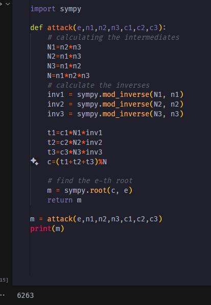
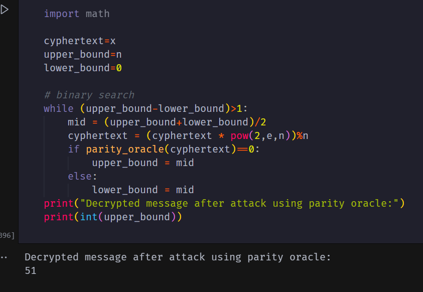

# Cryptography

## Homework: 4

---


### Navneet Kumar (B21CS050)

#### Q1

[https://colab.research.google.com/github/Navneetkrh/Different-Attacks-on-RSA/blob/main/q1.ipynb](https://colab.research.google.com/github/Navneetkrh/Different-Attacks-on-RSA/blob/main/q1.ipynb)

As the public  exponent was very small, there was a good chance that the message was not larger than the product of these three given moduli.So,for a bigger value of modulus the message would be smaller than the modulus .
The problem was solved by utilising chinease remainder theorem to combine the results for different moduli.
Then a cube root was taken to get the original message as e=3.

```
The message is: 6263

```



I took a reference from the following link to solve this problem:

https://crypto.stackexchange.com/questions/6713/low-public-exponent-attack-for-rsa

---


#### Q2

[https://colab.research.google.com/github/Navneetkrh/Different-Attacks-on-RSA/blob/main/q2.ipynb](https://colab.research.google.com/github/Navneetkrh/Different-Attacks-on-RSA/blob/main/q2.ipynb)

link to collab
we can utilise the malleablity of the RSA encryption scheme for this problem.
I multiplied the given cipher text by ``2^e mod n`` and then decrypted the cipher text to get the message ``2*m``.
Then I divided the message by 2 to get the original message.

---


#### Q3

[https://colab.research.google.com/github/Navneetkrh/Different-Attacks-on-RSA/blob/main/q3.ipynb](https://colab.research.google.com/github/Navneetkrh/Different-Attacks-on-RSA/blob/main/q3.ipynb)

The padding oracle verifies the padding by checking the first two bytes of the decrypted message and after that it checks for the "0x00" byte. After that it gets the ASN1 which contains the length of the hash which is verified after. If the padding is not correct then the padding oracle returns False else it returns True.

task was to find another ciphertext which passes the padding oracle test without using the private or public key.
so, i started with s=2 and multiplied the given cipher text with s and kept on increasing the value of s until the padding oracle returned True.
That's how I found the value of s.

I have verified the value of s by decrypting the cipher text and checking the padding at the end of my ipynb file.

---


#### Q4

[https://colab.research.google.com/github/Navneetkrh/Different-Attacks-on-RSA/blob/main/q4.ipynb](https://colab.research.google.com/github/Navneetkrh/Different-Attacks-on-RSA/blob/main/q4.ipynb)

task was to obtain the message using the last bit parity oracle.

This was done using the fact that multiplication of two odd prime numbers p,q will be odd .Hence,our modulus is odd.
And multiplication of any number by 2 will be even after takingh modulus if it is smaller than the modulus else it will become odd as even-modulus=odd .

we can keep shilfting(multiplying the cipher text by ``2^e mod n``  it will shift the message by one bit everytime )

We can Itratively reduce the seach space to get the plaintext.It's basically binary search.



---


#### Q5

[https://colab.research.google.com/github/Navneetkrh/Different-Attacks-on-RSA/blob/main/q5.ipynb](https://colab.research.google.com/github/Navneetkrh/Different-Attacks-on-RSA/blob/main/q5.ipynb)

This one is also a padding oracle attack.
we know the message is of the form ``00||02||padding||00||message``.
 ``B=2^(K_bits)``
 we know our message is between  ``2*B`` and ``3*B``
 we search for a ciphertext passing the padding oracle test in this range.
 Then we can keep reducing the search space.
